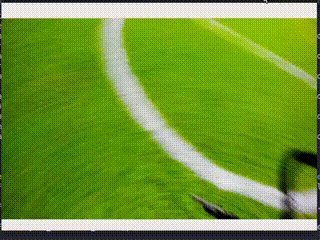
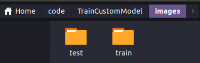
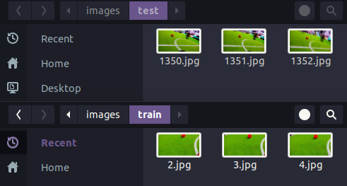
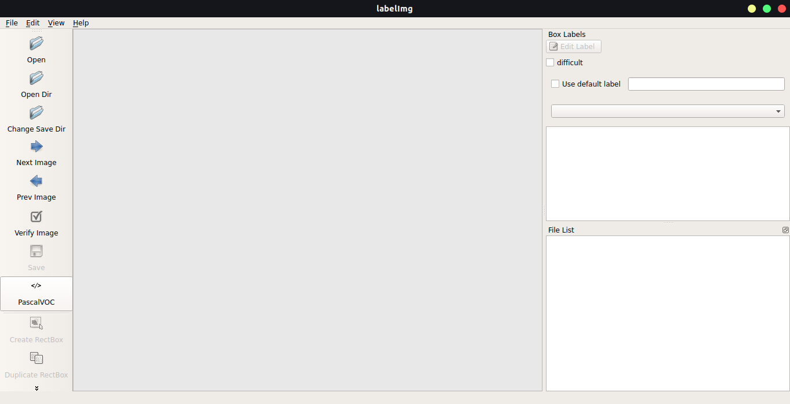
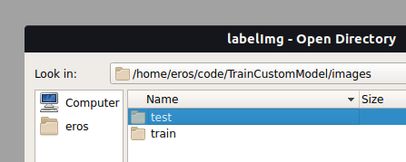
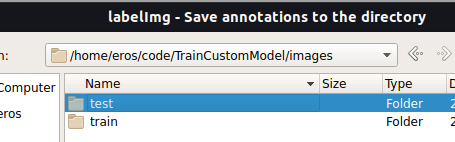
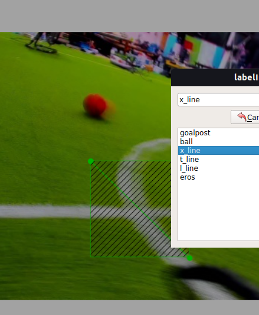
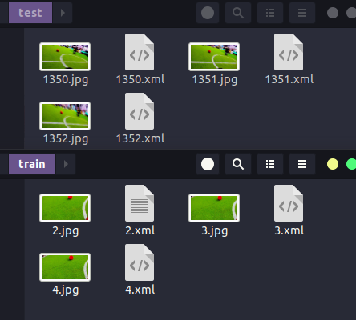

# TrainCustomModel - Introduction
This repository will explain you the way to train your custom object detection model using tensorflow via google colab (FREE GPU). This tutorial is a combination of several tutorial below:

1. [How to train custom object detection model using Google Colab (Free GPU) Part 1](https://www.youtube.com/watch?v=f2ccs2xziLk)
2. [How to train custom object detection model using Google Colab (Free GPU) Part 2](https://www.youtube.com/watch?v=5qQB8dZRgXQ)
3. [How to train custom object detection model using Google Colab (Free GPU) Part 3](https://www.youtube.com/watch?v=SMis3UjTIBY)
4. [How to Train a Custom Model for Object Detection (Local and Google Colab!)](https://www.youtube.com/watch?v=_gGI91BmIdk)



## Contents
- [TrainCustomModel - Introduction](#traincustommodel---introduction)
  - [Contents](#contents)
  - [LabelImg Setup](#labelimg-setup)
    - [Windows](#windows)
    - [Linux](#linux)
  - [Labeling Instruction](#labeling-instruction)

## LabelImg Setup

### Windows
1. You can download labelImg [here](https://github.com/tzutalin/labelImg/files/2638199/windows_v1.8.1.zip)
2. Change `predefined_classes.txt` inside `data` with your object target name. Here is the example that i use:
```
goalpost
ball
x_line
t_line
l_line
eros
```
### Linux
1. Open your terminal
2. Type these following commands:
```bash
sudo apt-get update
sudo apt-get install python3 python3-pip pyqt5-dev-tools git
git clone https://github.com/tzutalin/labelImg.git
cd labelImg
pip3 install -r requirements/requirements-linux-python3.txt
make qt5py3
```

3.  Change `predefined_classes.txt` inside `data` with your object target name. Here is the example that i use:
```
goalpost
ball
x_line
t_line
l_line
eros
```

4.  To run labelImg, you can type `python3 labelImg.py` in your terminal inside labelImg folder

## Labeling Instruction
1. First, you need to create two folders: train and test
   <figure>
   <center></center>
   </figure>

2. Split your images into two folder
   <figure>
   <center></center>
   </figure>

   **note**: you need to put 80% of your images to `train` folder and put the rest of it to `test` folder (i only put three images as an example). Also make sure that all of your object target is exist in both folder.

3. Open your labelImg and make sure that your save format is `PascalVOC`
   <figure>
   <center></center>
   </figure>

4. Click `Open Dir` and select your folder. I started it with `test` folder
   <figure>
   <center></center>
   </figure>

5. Click `Change Save Dir` and select the same folder that you opened in previous step
   <figure>
   <center></center>
   </figure>

6. Click `view` and select `auto save mode`

7. Start annotate your images. Click <kbd>W</kbd> to create rectangle. Click <kbd>D</kbd> to move to the next image, and Click <kbd>A</kbd> to move to the previous image

8. Select your object label

    <figure>
   <center></center>
   </figure>

9. If you are done with all of images in `test` folder, you can repeat step **4** with `train` folder
    
10. If you did it in a correct way, you will found several xml file inside your `test` and `train` folder

<figure>
<center></center
</figure>