# TrainCustomModel - Introduction
This repository will explain you the way to train your custom object detection model using tensorflow via google colab (FREE GPU). This tutorial is a combination of several tutorial below:

1. [How to train custom object detection model using Google Colab (Free GPU) Part 1](https://www.youtube.com/watch?v=f2ccs2xziLk)
2. [How to train custom object detection model using Google Colab (Free GPU) Part 2](https://www.youtube.com/watch?v=5qQB8dZRgXQ)
3. [How to train custom object detection model using Google Colab (Free GPU) Part 3](https://www.youtube.com/watch?v=SMis3UjTIBY)
4. [How to Train a Custom Model for Object Detection (Local and Google Colab!)](https://www.youtube.com/watch?v=_gGI91BmIdk)


## Contents
- [TrainCustomModel - Introduction](#traincustommodel---introduction)
  - [Contents](#contents)
  - [LabelImg Setup](#labelimg-setup)
    - [Windows](#windows)
    - [Linux](#linux)
  - [Labeling Instruction](#labeling-instruction)
  - [Edit Configuration](#edit-configuration)
  - [Edit LabelMap](#edit-labelmap)
  - [Edit generate_tfrecord](#edit-generate_tfrecord)
  - [Prepare your training folder](#prepare-your-training-folder)
  - [Google Colab Steps](#google-colab-steps)
  - [Done](#done)

## LabelImg Setup

### Windows
1. You can download labelImg [here](https://github.com/tzutalin/labelImg/files/2638199/windows_v1.8.1.zip)
2. Change `predefined_classes.txt` inside `data` with your object target name. Here is the example that i use:
```
goalpost
ball
x_line
t_line
l_line
eros
```
### Linux
1. Open your terminal
2. Type these following commands:
```bash
sudo apt-get update
sudo apt-get install python3 python3-pip pyqt5-dev-tools git
git clone https://github.com/tzutalin/labelImg.git
cd labelImg
pip3 install -r requirements/requirements-linux-python3.txt
make qt5py3
```

3.  Change `predefined_classes.txt` inside `data` with your object target name. Here is the example that i use:
```
goalpost
ball
x_line
t_line
l_line
eros
```

4.  To run labelImg, you can type `python3 labelImg.py` in your terminal inside labelImg folder

## Labeling Instruction
1. First, you need to create two folders: train and test
   <figure>
   <center></center>
   </figure>

2. Split your images into two folder
   <figure>
   <center></center>
   </figure>

   **note**: you need to put 80% of your images to `train` folder and put the rest of it to `test` folder (i only put three images as an example). Also make sure that all of your object target is exist in both folder.

3. Open your labelImg and make sure that your save format is `PascalVOC`
   <figure>
   <center></center>
   </figure>

4. Click `Open Dir` and select your folder. I started it with `test` folder
   <figure>
   <center></center>
   </figure>

5. Click `Change Save Dir` and select the same folder that you opened in previous step
   <figure>
   <center></center>
   </figure>

6. Click `view` and select `auto save mode`

7. Start annotate your images. Click <kbd>W</kbd> to create rectangle. Click <kbd>D</kbd> to move to the next image, and Click <kbd>A</kbd> to move to the previous image

8. Select your object label

    <figure>
   <center></center>
   </figure>

9. If you are done with all of images in `test` folder, you can repeat step **4** with `train` folder
    
10. If you did it in a correct way, you will found several xml file inside your `test` and `train` folder

<figure>
<center></center
</figure>

## Edit Configuration
1. There are tons of configuration in tensorflow. But i choose ssd_mobilenet_v2 due to its speed and accuracy. If you want to try another config, you can access it [here](https://github.com/tensorflow/models/tree/master/research/object_detection/samples/configs)

2. Open your tensorflow config

3. Change your number of classes based on total object that you want to detect
   <figure>
   <center>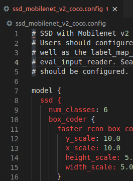</center>
   </figure>

4. Set `fine_tune_checkpoint` based on your config. If you use ssd_mobilenet_v2, you can ignore it cause i already set it. But if you want to use another config, you can check the fine_tune_checkpoint list [here](https://github.com/tensorflow/models/blob/master/research/object_detection/g3doc/tf1_detection_zoo.md)

    <figure>
    <center>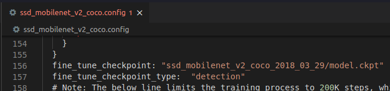</center>
    </figure>

## Edit LabelMap
1. Open `labelmap.pbtxt`
   
2. change the content based on your model
   <figure>
    <center>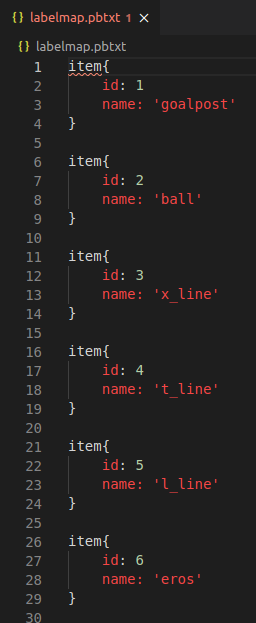</center>
    </figure>

3. Save your `labelmap.pbtxt`

## Edit generate_tfrecord

1. Open `generate_tfrecord.py`
   
2. change the content based on your model
   <figure>
    <center>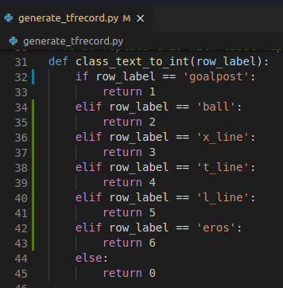</center>
    </figure>

3. Save your `generate_tfrecord.py`

## Prepare your training folder

1. Zip these file `images`, `generate_tfrecord.py`, `labelmap.pbtxt`, `ssd_mobilenet_v2_coco.config` (your config), and `train.py`
    <figure>
    <center>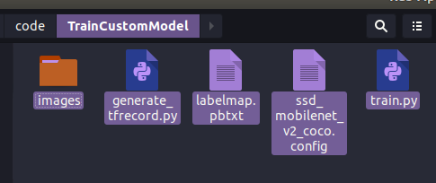</center>
    </figure>

2. Rename it to `my_training.zip`
    <figure>
    <center>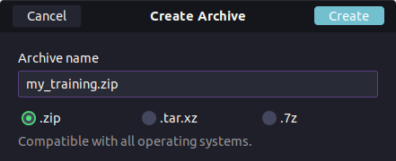</center>
    </figure>

## Google Colab Steps

1. Drop your `my_training.zip` and `TrainCustomModelOnColab.ipynb` to your google drive
   <figure>
    <center>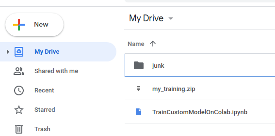</center>
    </figure>

2. Open your `TrainCustomModelOnColab.ipynb` with **Google Colab**. If you are not adding it yet, you can add it by clicking `Connect more apps` and search `Google Colaboratory`
    <figure>
    <center>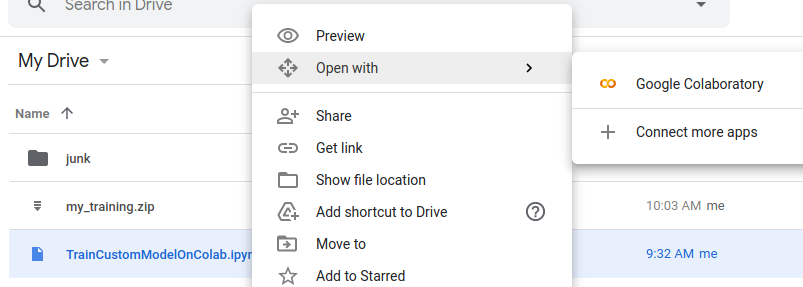</center>
    </figure>

3. Click `runtime`, and then click `change runtime type`, and select `GPU`

4. Click `runtime` and select `run all` to start your **Google Colab** program. You can check your running update below every code
    <figure>
    <center>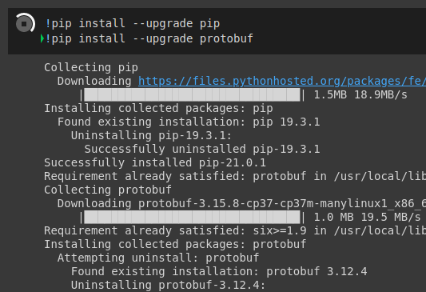</center>
    </figure>

   If you are worried about the process, you can run it one by one using <kbd>alt</kbd> + <kbd>enter</kbd> or click 'play' button for each step

5. Don't forget to mount your drive with Google Colab by clicking the link that shown there or you can click [here](https://accounts.google.com/o/oauth2/auth?client_id=947318989803-6bn6qk8qdgf4n4g3pfee6491hc0brc4i.apps.googleusercontent.com&redirect_uri=urn%3aietf%3awg%3aoauth%3a2.0%3aoob&scope=email%20https%3a%2f%2fwww.googleapis.com%2fauth%2fdocs.test%20https%3a%2f%2fwww.googleapis.com%2fauth%2fdrive%20https%3a%2f%2fwww.googleapis.com%2fauth%2fdrive.photos.readonly%20https%3a%2f%2fwww.googleapis.com%2fauth%2fpeopleapi.readonly%20https%3a%2f%2fwww.googleapis.com%2fauth%2fdrive.activity.readonly%20https%3a%2f%2fwww.googleapis.com%2fauth%2fexperimentsandconfigs%20https%3a%2f%2fwww.googleapis.com%2fauth%2fphotos.native&response_type=code)
   
6. Enter your authorization code
    <figure>
    <center>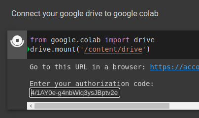</center>
    </figure>

7. If your authorization and setup step succesfull, you can check your training progress
   <figure>
    <center>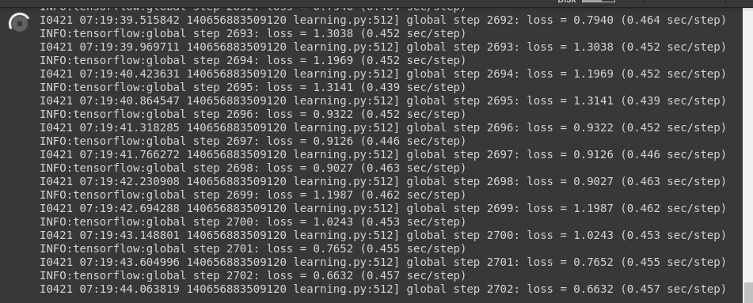</center>
    </figure>

   You can stop your training process when the loss rate is stagnant at low value (the lower your loss rate, the better result you will achieve) and your system already generate a checkpoint

   <figure>
    <center>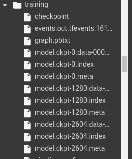</center>
    </figure>

8. Stop your training process by clicking stop button
   <figure>
   <center>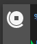</center>
   </figure>

9. Export your training to inference graph by changing `ckpt-XXXX` with the last checkpoint that you have (your ckpt index is like a picture on step **7**)
   <figure>
   <center>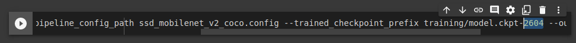</center>
   </figure>

10.   Run all step and make sure that all step is done. if you did every step in a corret way, you will find `model_graph.zip` and `models-master.zip` in your Google Drive
   <figure>
   <center>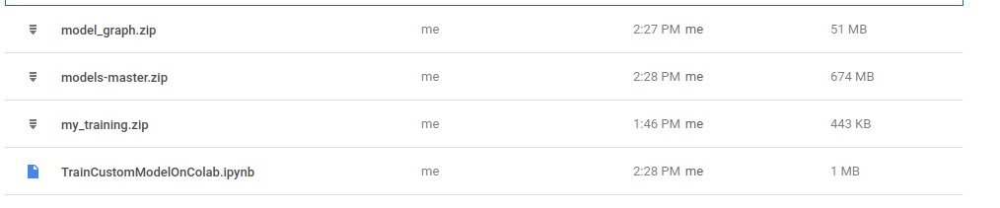</center>
   </figure>

11. Your training results is inside `models-master.zip`
- models-master
  - content
    - models-master
      - research
        - object-detection
          - new_graph
            - `frozen_inference_graph.pb`
            - `pipeline.config`

## Done

Your training process is over, you can check your training process by running inference that load your `frozen_inference_graph.pb` and `pipeline.config`. Good Luck!